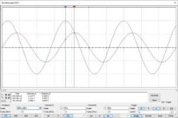
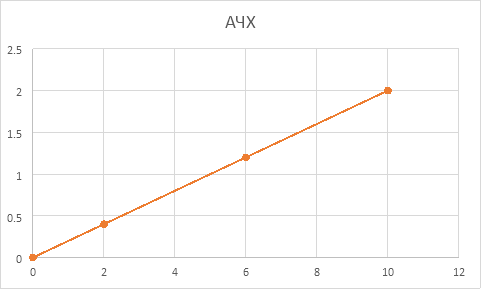

# ElectronicsAndElectricalEngineering
## ИССЛЕДОВАНИЕ ПАССИВНЫХ R-, C-, L-ЦЕПЕЙ
**Цель лабораторной работы:**

Закрепление теоретического учебного материала по построению, анализу и расчету частотных и переходных характеристик простых R-, C-, L-цепей. 

Освоение методики анализа и расчета частотных и переходных характеристик цепей. 

Приобретение умений экспериментального исследования рассматриваемых цепей с использованием лабораторной станции NI ELVIS ǀǀ+ и программы схемотехнического проектирования NI MULTISIM 12. 

**Ход работы:**

**ИНТЕГРИРУЮЩЕЕ ЗВЕНО**

1. Собрать схему интегрирующего звена (см. рис. 23) на рабочем столе лабораторного стенда Ni ELVIS ǀǀ+, используя ранее рассчитанные значения элементов цепи

Исходные данные: 

fв = 2000 Гц

Rн = 2000 Ом

Uвх = 10 В

Uвых(f=0) = 4 В

Расчёт параметров:

Uвых= UвхRнRн+R1 →R1= Uвх\*RнUвых- Rн= 10\*20004-2000=3 КОм

ω= 1R1\*С1=2πf → С1= 1R1\*RnR1+Rn\*2πf= 13000\*20003000+2000\*2π\*2000= 66 нФ

1. Снять АЧХ и ФЧХ исследуемой цепи. Определить значения высшей граничной частоты, используя виртуальные измерительные приборы лабораторного стенда

Высшая граничная частота - w=1R1\*RnR1+Rn\*C1=12 kHz 

|
С1=66 нФ

|
| :-: |
|
Rн = 2 кОм

|

3. Исследовать влияние значений элементов цепи на ход АЧХ цепи

4. ` `При исходных значениях элементов цепи рассчитать значение С1, обеспечивающее получение fв = 40 кГц. Подать на вход цепи последовательность положительных прямоугольных импульсов с амплитудой 5 В, частотой следования f, принимающую значения 20, 40, 80 кГц. В этих условиях снять диаграммы выходного напряжения, совместив их с диаграммами входного, и измерить параметры выходных импульсов (минимальное и максимальное значения выходных импульсов, длительности переднего и заднего фронтов).

Для расчёта ёмкости конденсатора С1, применим формулу

` `С1= 1R1\*RnR1+Rn\*2πf= 13000\*20003000+2000\*2π\*40000=1.7 нФ и снимем осциллограммы при

` `fв = 20, 40, 80 КГц. 

|f, кГц|tфп, мкс|tфз, мкс|Umax, В|Umin, В|
| :- | :- | :- | :- | :- |
|20|11\.5|11\.6|2|0|
|40|9\.5|8\.95|1\.94|0\.084|
|80|5\.5|5\.5|1\.67|0\.33|

**ДИФФЕРЕНЦИРУЮЩЕЕ ЗВЕНО**

1. ` `Собрать схему дифференцирующего звена (см. рис. 27) на рабочем столе лабораторного стенда Ni ELVIS ǀǀ+ , используя ранее рассчитанные значения элементов цепи. 

Исходные данные: 

fн = 30 Гц	

R1 = 400 Ом

Uвых(f=∞) = 4 В

Сн=0

Расчёт параметров:

С1= 1R1\*2πf= 11000\*2π\*30=13,2 мкФ

1. Снять АЧХ и ФЧХ исследуемой цепи. Определить значения низшей граничной частоты, используя виртуальные измерительные приборы лабораторного стенда
1. Исследовать влияние значений элементов цепи на ход АЧХ цепи.

|
С1=13,2 мкФ

|
| :- |
|
R1 = 400 Ом

|

1. При исходных значениях элементов цепи, рассчитать значение С1, обеспечивающее получение fн  = 4 кГц. Подать на вход цепи последовательность положительных прямоугольных импульсов с амплитудой 5 В, частотой следования f, принимающую значения 2, 4, 8 кГц. В этих условиях снять диаграммы выходного напряжения, совместив их с диаграммами входного, и измерить параметры выходных импульсов (значения положительного и отрицательного перепадов выходных импульсов, величину спада плоской вершины выходного импульса)

С1= 1R1\*2πf= 1400\*2π\*4000=99,5 нФ

|f, кГц|∆Uп, В|∆Uо, В|
| :- | :- | :- |
|2|12\.2|-12.2|
|4|11\.6|-11.6|
|8|10|10|

**КОМПЕНСИРОВАННЫЙ ДЕЛИТЕЛЬ НАПРЯЖЕНИЯ**

1. ` `В программе схемотехнического моделирования NI MULTISIM 12 собрать схему компенсированного делителя напряжения (рис. 31), используя ранее рассчитанные значения элементов цепи.

Исходные данные:

Uвх= 20 В

Uвых=2 В

R2 = 50000 Ом

С2 = 200 пФ

Расчёт параметров:

k= UвыхUвх=110

k= R2R2+R1 →R1=R2k-R2=50000110-50000=450000 Ом=450 КОм

R1C1=R2C2→C1=R2C2R1=50000\*200\*10-12450000=22\*10-12=22 пФ

1. Снять АЧХ и ФЧХ исследуемой цепи. 

1. Исследовать влияние значений элементов цепи на ход частотных зависимостей цепи.

Исходя из полученных данных прослеживается следующая зависимость:

\- При увеличении R1 уменьшается амплитуда выходного сигнала со сдвигом влево

\- При увеличении С1 увеличивается амплитуда выходного сигнала со сдвигом влево

\- При увеличении R2 увеличивается амплитуда выходного сигнала со сдвигом вправо

\- При увеличении С2 уменьшается амплитуда выходного сигнала со сдвигом вправо

1. Подать на вход цепи последовательность положительных прямоугольных импульсов с амплитудой 5 В и частотой следования f = 5 кГц. Снять диаграмму выходного напряжения при t1 = t2, t1 > t2, t1 < t2 совместив их с диаграммой входного.

  

**Вывод:** В ходе лабораторной работы мы закрепили теоретический материал по построению, анализу и расчету частотных и переходных характеристик простых R-, C-, L-цепей. Освоили методики анализа и расчета частотных и переходных характеристик цепей. Приобрели умения экспериментального исследования рассматриваемых цепей с использованием лабораторной станции NI ELVIS ǀǀ+ и программы схемотехнического проектирования NI MULTISIM 12. 

## ОДНОКАСКАДНЫЕ УСИЛИТЕЛИ С ЕМКОСТНОЙ СВЯЗЬЮ НА БИПОЛЯРНЫХ ТРАНЗИСТОРАХ
**Цель лабораторной работы:**

· Закрепление теоретического учебного материала по вопросам построения, анализа и расчета базовых однокаскадных схем усилителей с емкостной связью (схемы ОБ, ОЭ, ОК). 

· Освоение методики анализа и расчета режимов работы усилителей с емкостной связью по постоянному и переменному току на биполярных транзисторах. 

· Освоение методики расчета предложенных схем усилителей по заданным исходным данным. 

· Проведение экспериментального исследования предложенных схем с использованием лабораторной станции NI ELVIS ǀǀ+ и программы схемотехнического проектирования NI MULTISIM 12.

` `**Ход работы:**

**Расчёт схемы ОЭ:**

Исходные данные:

EК = 5 В

EБ = EК = 5 В

UвыхM = 2 В

RH = 400 Ом

Rк = RH = 400 Oм

RГ = 1000 Ом

СН = 100 пФ

fH=80 Гц

fВ≥1 МГц

*β =* 150

1. Выбор положения рабочей точки на выходных характеристиках транзистора, обеспечивающей оптимальное воспроизведение входного сигнала с заданной амплитудой на нагрузке.

IКА = Ik2 = 12.52 = 6.25 мА 
IБA = 42 мкА

UБ0 = 0.6 B

2\. Расчет величины напряжения источника питания (если его значение не задано)

EК = 5 В

EЭ = 5 В

3\. Выбор и расчет значений пассивных элементов схемы, обеспечивающих параметры статического и динамического режимов усилителя в заданном диапазоне частоты входного сигнала.

RБ= EБ-UБ0IБ= 5-0,642\*10-6=104.8 кО

**Средние частоты:**

RВХ(ОЭ)=300 Ом

rЭ=φtIЭ=0,02500,0127=2 Ом

rБ=rЭβ+1- RВХ(ОЭ)=2 \*151 - 300 =  2 Ом

RКН=RK∙RНRK+RН=400∙400400+400≈200 Ом

KUo=β∙RКНRг+Rвх(ОЭ)=150 \* 2001000+300≈23.1

EГ=UMвыхKUo=223.1≈0.09 В

**Низшие частоты:**

τнэкв=1ωн, учитывая, что τ1н=τ2н

τ1н=τ2н=1πf=1π\*80=4 мс

С1=τ1RГ+RВХ=3,1 мкФ

С2=τ2RН+RК=5 мкФ

Вывод: в ходе лабораторной работы мы освоили методики анализа и расчета режимов работы усилителей с емкостной связью по постоянному и переменному току на биполярных транзисторах и провели исследования предложенных схем с использованием программы схемотехнического проектирования NI MULTISIM 12.

